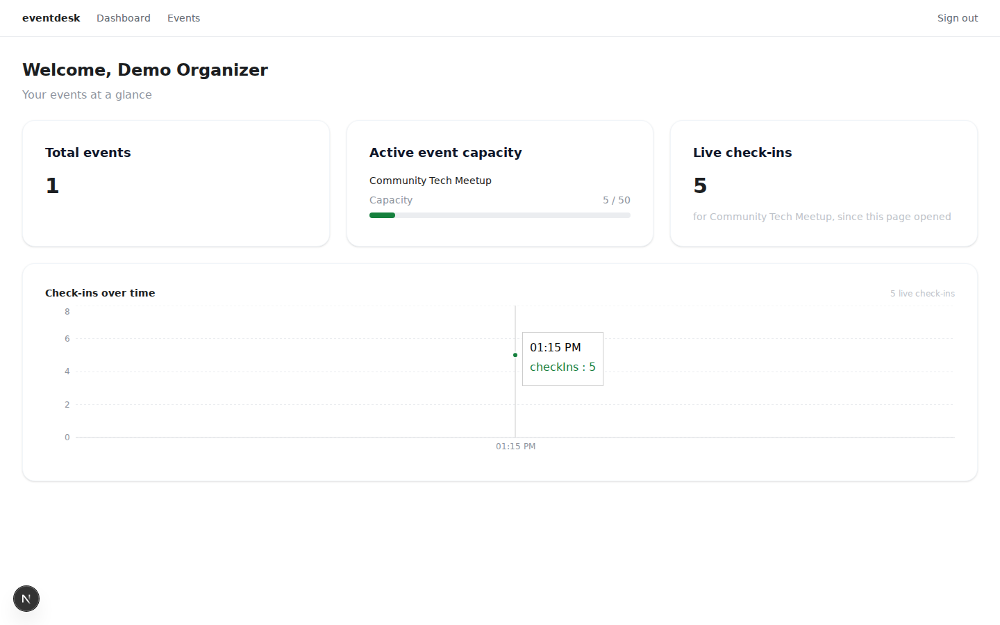

# eventdesk-web

Frontend for eventdesk — an organizer console for managing events, registrations, and live attendee check-in, plus a public event page for attendee self-registration. Built with Next.js (App Router), TanStack Query, Zustand, React Hook Form + Zod, and Socket.io.

Pairs with [eventdesk-api](https://github.com/franciscothiago0111/eventdesk-api) (NestJS).

## Live check-in dashboard



The dashboard updates in real time as attendees are checked in — no manual refresh. The "Live check-ins" tile and the trend chart both react to `checkin.recorded` events pushed over a Socket.io room scoped to the active event; the registrations page's per-row status badge updates the same way. Screenshot above is from a live run against the real API + Postgres/Redis stack: an organizer account, one published event, five registrations, and five check-ins recorded while the dashboard was open.

## Features

- **Auth** — register/login against `eventdesk-api`, session held in a Zustand store (`persist` to `localStorage`; see `src/core/services/token-storage.ts` for the MVP tradeoffs of that choice)
- **Events** — create, edit, publish, close, list, view detail (capacity + status), gallery image uploads, per-event schedule
- **Public event page** — unauthenticated `/e/[id]` page where attendees self-register for a published event, no login required
- **Registrations** — list per event, CSV export, live check-in status badge
- **Dashboard** — total events, active event capacity, live check-in count + trend chart
- **Notifications** — in-app notification list, fed by `eventdesk-api`'s `NotificationModule`
- **PDF export** — event details exportable as PDF via `@react-pdf/renderer` (`src/core/pdf`)
- **Realtime** — Socket.io client joins a per-event room and merges incoming check-ins (and registrations) into the TanStack Query cache, deduped by ID

## Getting started

### Prerequisites
- Node.js + Yarn
- [eventdesk-api](https://github.com/franciscothiago0111/eventdesk-api) running locally (see its README) — this app has no backend of its own

### 1. Environment

```bash
cp .env.example .env
```

`.env.example` documents `NEXT_PUBLIC_API_URL` and `NEXT_PUBLIC_WS_URL`, both defaulting to `http://localhost:3001` to match the API's default port.

### 2. Install & run

```bash
yarn install
yarn dev
```

Open [http://localhost:3000](http://localhost:3000). Unauthenticated visits redirect to `/login`. There's no in-app registration UI yet — create an organizer via the API directly first: `POST http://localhost:3001/auth/register` with `{ name, email, password }` (documented in the API's Swagger UI at `/docs`), then log in through the web UI with those credentials.

## Deployment

Not yet deployed — `eventdesk-web` → Vercel, pointed at a deployed `eventdesk-api`, is tracked as a separate Phase 8 item. This section will link to the live instance once that lands.

## Testing

```bash
yarn test        # Vitest — schema, hook (MSW-mocked), and component tests
yarn test:e2e     # Playwright — full happy path against live dev servers (API + web)
yarn lint
yarn build
```

## Tech stack

Next.js (App Router) · TypeScript · TanStack Query · Zustand · React Hook Form + Zod · Axios · Socket.io client · Tailwind · Radix UI · Recharts · `@react-pdf/renderer` · Vitest + Testing Library + MSW · Playwright

## Project structure

```
src/
├── app/
│   ├── (auth)/login/                       public route group
│   ├── (public)/e/[id]/                     public route group — unauthenticated attendee self-registration page
│   └── (protected)/                        gated by ProtectedShell, redirects to /login without a session
│       ├── dashboard/
│       ├── notifications/
│       └── events/
│           ├── new/                          create-event form
│           └── [id]/                          detail: overview, registrations, schedule, image gallery
│                   └── edit/
├── core/
│   ├── api/                     axios instance, envelope-unwrapping interceptor
│   ├── config/                  typed NEXT_PUBLIC_* env
│   ├── hooks/                   use-auth (Zustand), use-csv-download, use-pdf-download, use-notifications, use-persisted-filters
│   ├── pdf/                     @react-pdf/renderer templates (event details export)
│   ├── providers/                React Query provider + Toaster
│   ├── realtime/                 socket-provider (module-level singleton), use-live-checkins, use-live-registrations
│   └── services/                 auth.service, notifications.service, token-storage
├── components/ui/               hand-rolled component set (Button, Table, Modal, etc.)
├── shared/
│   ├── types/                     types mirroring the API's presenters (event, registration, check-in, notification, dashboard)
│   └── utils/                     date, event-category, event-images helpers
└── test/msw/                     MSW request handlers shared by Vitest tests
```
